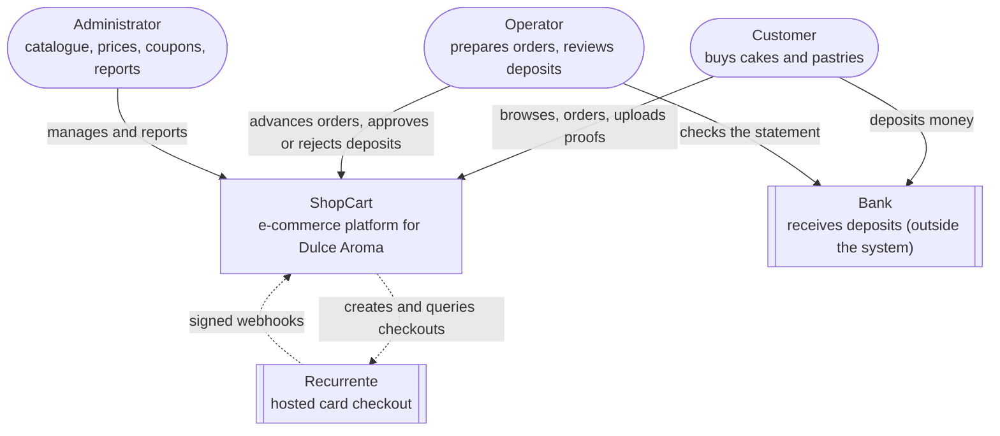

# C4 · System context

```mermaid
flowchart TB
  customer(["Customer<br/>buys cakes and pastries"])
  operator(["Operator<br/>prepares orders, reviews deposits"])
  admin(["Administrator<br/>catalogue, prices, coupons, reports"])
  shopcart["ShopCart<br/>e-commerce platform for Dulce Aroma"]
  recurrente[["Recurrente<br/>hosted card checkout"]]
  bank[["Bank<br/>receives deposits (outside the system)"]]

  customer -->|browses, orders, uploads proofs| shopcart
  operator -->|advances orders, approves or rejects deposits| shopcart
  admin -->|manages and reports| shopcart
  shopcart -.->|creates and queries checkouts| recurrente
  recurrente -.->|signed webhooks| shopcart
  customer -->|deposits money| bank
  operator -->|checks the statement| bank
```

The bank is not integrated: a human compares the proof with the bank statement. Recurrente is optional and only active with valid credentials.
